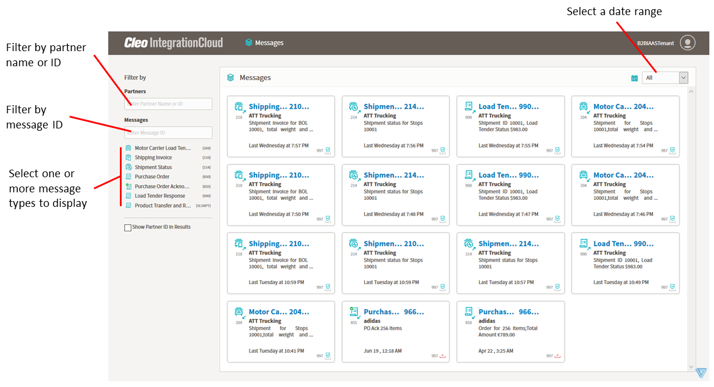
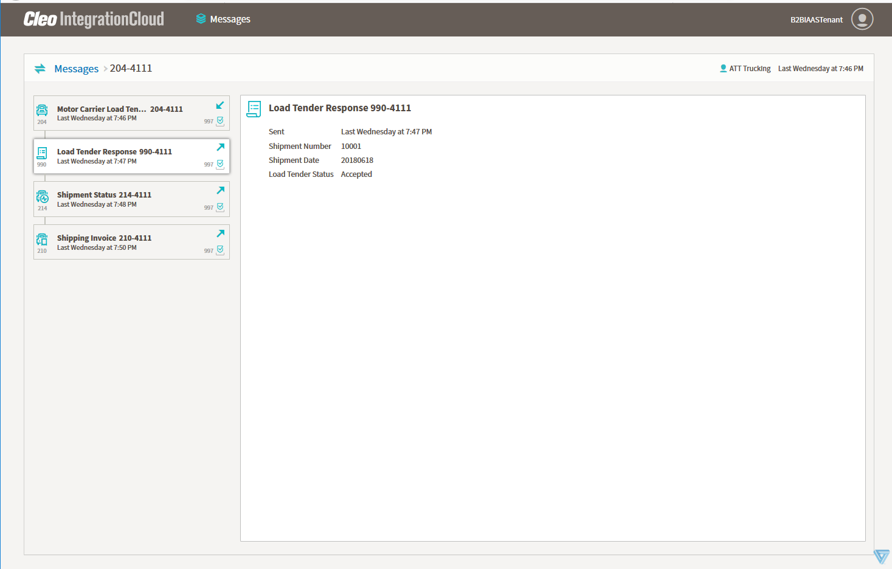
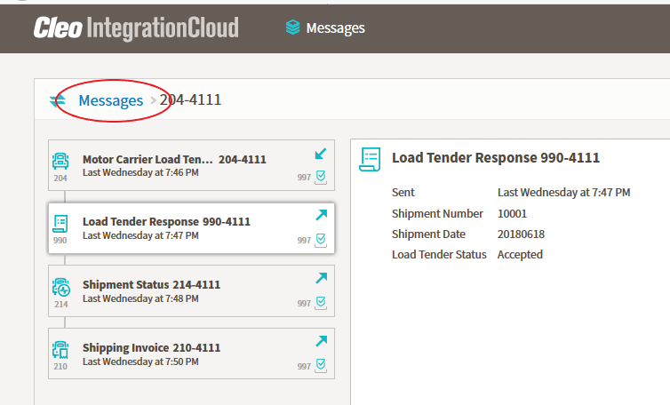

# Messages page

The Messages page displays information about messages on your system in one of two views: 
- Tile view
- Context view

## Tile view

By default, the Messages page displays the Tile view.

In Tile view, the main part of the page is an array of tiles containing high-level information about messages from your system and the left column contains some controls for filtering the messages displayed.

You can filter the messages displayed as follows:
- By partner -- In the **Partners** field, enter a partner's name or ID to display only messages pertaining to that partner. You must enter the entire name or ID. 
- By message -- In the **Messages** field, enter a message ID to display the matching message. You must enter the entire message ID.
- By message type -- Select one or more message types to display just those message types. Deselect a message type to hide those messages. All messages are displayed when no message types are highlighted. 
- By date -- Select a date range to display messages that were sent in that range.

Each tile provides details about a single message.

There are four possible functional acknowledgment (FA) status icons.

| Icon  | Descrption |
| --- | --- |
|       | Successful acknowledgment|
|       | Error with acknowledgment      |
|  | Acknowledgment not received |
|  | Acknowledgment not expected |

Click any message tile to display the Context view. 

## Context view
The Context view displays the message you clicked as part of a series of related messages. 

The left column displays a set of tiles (one message per tile) listed in chronological order. By default, the main part of the page displays detailed information about the message you clicked in the Tile view. To view detailed information about another message, click the corresponding tile in the left column.

Click Messages to return to the Tile view of the Messages page.

